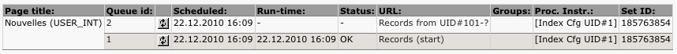

.. Indexed Search & Crawler - The Missing Manual documentation master file, created by
   sphinx-quickstart on Wed Apr 29 17:57:22 2020.
   You can adapt this file completely to your liking, but it should at least
   contain the root `toctree` directive.

=============================================
Indexed Search & Crawler - The Missing Manual
=============================================

Did you ever tried to configure system extension Indexed Search and its friend Crawler? Unless you simply chose to run them “out-of-the-box”, it probably turned
out to be a nightmare to configure, isn't it?

This article aims at providing a step-by-step tutorial on how installing and configuring those extensions to help efficiently index your TYPO3 content.

I won't really detail how showing the search result as I find it quite easy to do. But properly indexing your content is, from my point of view, the real
challenge when integrating a search engine onto your website. This is why I started this article.

.. contents:: Table of Contents
   :depth: 2

Configuring your Server
-----------------------

You certainly want to index external documents referenced on your Web pages in addition to
standard text elements, don't you? If so, you will have to make sure you have properly installed a
few third party binaries:

- :program:`pdftotext` and :program:`pdfinfo` for PDF files;
- :program:`catdoc` for Microsoft Word documents (unfortunately not recent docx files);
- :program:`xlhtml` for Microsoft Excel spreadsheets (unfortunately not recent xlsx files);
- :program:`ppthtml` for Microsoft Powerpoint presentations (unfortunately not recent pptx files);
- :program:`unzip` for OpenOffice documents;
- :program:`unrtf` for RTF (who does use this format nowadays? Anyway, it does not cost much to
  configure).
  
If you are running Debian or Ubuntu on your Linux server, this is easily done with:

.. code-block:: bash

   sudo apt-get install xpdf-utils catdoc xlhtml ppthtml unzip unrtf

This will install all those binaries into :file:`/usr/bin/`.

Before loosing your hairs fighting with Indexed Search to understand why external documents are
not indexed at all, make sure you specified :file:`/usr/bin` in the ``open_basedir`` directive of
your Apache2 virtual host configuration (if you use it of course). This is really needed only if
``safe_mode`` is off, which should be the case anyway:

.. code-block:: apache

   <Directory /path/to/web/root>
      AllowOverride All
      Options FollowSymLinks
      php_admin_value safe_mode 0
      php_admin_value safe_mode_gid 0
      php_admin_value open_basedir /path/to/web/root:/usr/bin:/tmp:/dev/urandom
   </Directory>

This is needed because Indexed Search does this to see whether one of those third-party binaries
is available (in :file:`typo3/sysext/indexed_search/class.external_parser.php`):

.. code-block:: php

   $pdfPath = rtrim($indexerConfig['pdftools'], '/') . '/';
   if (ini_get('safe_mode') || (@is_file($pdfPath . 'pdftotext' . $exe)
                   && @is_file($pdfPath . 'pdfinfo' . $exe))) {
           ...
   }

The ``@is_file()`` test will fail if you use open_basedir but do not have :file:`/usr/bin` as
allowed path. The funny part is that, for once, having ``safe_mode`` on would not have given you
headache :-)

You think your configuration is valid? Friendly hint, test it again with following PHP snippet.
You will definitively thank me for not having lost time with some hidden ``open_basedir`` setting
(I did...):

.. code-block:: php

   <?php
   error_reporting(E_ALL & ~E_NOTICE);
   ini_set('display_errors', 1);
    
   echo '
open_basedir: ' . ini_get('open_basedir') . '
';
    
   if (is_file('/usr/bin/pdfinfo')) {;
           echo '
pdfinfo found
';
   } else {
           echo '
pdfinfo not found
';
   }

Configuring TYPO3, Indexed Search and Crawler
---------------------------------------------

Go to :menuselection:`Admin Tools --> Ext Manager` and click on Indexed Search.

Make sure Paths to PDF parsers, unzip, WORD parser, EXCEL parser, POWERPOINT parser and RTF parser
all contain :file:`/usr/bin/`. E.g.,

Then, make sure indexing of content is not performed automatically when showing a page in
frontend and let use crawler to index external files:

New Backend User
""""""""""""""""

Crawler requires a backend user **_cli_crawler**. Go to
:menuselection:`Admin Tools --> User Admin` and create this backend user with a random password.
This user must not be an administrator and should not be part of any backend user group.

no_cache
""""""""

Oh yes! Before I forget to write it down, make sure you do not try to index a page with
"no_cache=1", you would lose your time and your energy trying to figure out why it does not work
;-)

TypoScript Setup
""""""""""""""""

It's time to ensure indexing of content and files is allowed. Open your TypoScript and add these
two lines:

.. code-block:: typoscript

   config.index_enable = 1
   config.index_externals = 1

Separation of Concerns for Indexed Search and Crawler
-----------------------------------------------------

Before really starting to index content, we should take a step back to understand the roles of
Indexed Search and Crawler.

Indexed Search
""""""""""""""

This is the engine which actually indexes content and provides a frontend plugin to let you
search for content and show the results.

Crawler
"""""""

This extension is in charge of two complementary jobs:

1. Generate URLs of pages to be processed (with any GET parameter required, e.g., "L" for
   language or "tx_ttnews[tt_news]" to show the details of a tt_news record) and enqueue them for
   processing by the other job.
2. Process the queue of URLs and take the appropriate action (in our case invoke Indexed Search
   to index the page or the document).

When generating URLs, the crawler will automatically be able to browse (well, crawl...) your
website and enqueue the different pages (with ``/index.php?uid=... ``). But if your site is
multilingual, you will have to tell it to generate variations for each and every page (with
``/index.php?uid=...&L=0`` and ``/index.php?uid=...&L=1`` for instance).

When a link to a document is encountered while indexing the content of a page, Indexing Search
will not index it right away but instead will add it to the queue of pages and documents to be
indexed (because option "Use crawler extension to index external files" was ticked in Indexed
Search configuration).

This process is depicted below:

Indexing Site Content and Files
-------------------------------

In order to well understand the indexing process, I suggest to focus on indexing a single page
and execute each and every step manually, without any scheduled task.

I suggest to empty indexing and crawler tables before each task, this prevents many side effects
and helps better understanding inner working of the indexing.

Truncating MySQL Tables
"""""""""""""""""""""""

.. code-block:: sql

   TRUNCATE TABLE index_debug;
   TRUNCATE TABLE index_fulltext;
   TRUNCATE TABLE index_grlist;
   TRUNCATE TABLE index_phash;
   TRUNCATE TABLE index_rel;
   TRUNCATE TABLE index_section;
   TRUNCATE TABLE index_stat_search;
   TRUNCATE TABLE index_stat_word;
   TRUNCATE TABLE index_words;
   TRUNCATE TABLE tx_crawler_process;
   TRUNCATE TABLE tx_crawler_queue;
   UPDATE index_config SET timer_next_indexing = 0;

Crawler Configuration
"""""""""""""""""""""

As already explained, the crawler already knows how to loop on your page tree to enqueue each
page. What it needs however, is to be instructed the operation to be invoked for the page. 
Typically for us, the operation is “to index the content”. Other instructions may be present; for 
instance extension cachemgm provides a new instruction that lets you prepare the TYPO3 cache of 
the underlying page.

Crawler works with both old-style and modern configuration:

- old-style refers to TypoScript-based configuration instructions stored as pageTS;
- modern configuration refers to Crawler configuration records created and managed as any
  database record, from :menuselection:`Web --> List`.

In fact, using configuration records instead of old-style TypoScript may not always be the best
option, particularly when you want to index protected content. But we will come to that again
later.

With either method though, the meaning is the same; the configuration tells crawler:

1. What to do with the underlying page or document (for us it will be "index it").
2. Possibly how to transform or generate new URLs for the corresponding page before processing it
   (used for instance to index multilingual content or to send a whole bunch of single news to
   the indexing process).

.. hint::

   You may access the very latest version of crawler using a Git client:
   https://github.com/AOEpeople/crawler.

Let's Start!
""""""""""""

We will create a very basic crawler configuration allowing the whole page tree to be indexed.

1. Go to :menuselection:`Web --> List`.
2. Select your root page (typically the homepage).
3. Add a record from type "Crawler Configuration" (under section "Site Crawler"):

   .. image:: images/simple-indexing.png
      :align: center

That's it! We are now able to use this configuration to index our website.

.. note::

   It is wise to always define the domain for your crawler configuration. Either type it in the
   corresponding field or choose a domain record. It will be needed, e.g., when indexing database
   records.

Do a test with a specific page:

1. Go to :menuselection:`Web --> Info`.
2. Select a page in your page tree.
3. Select :menuselection:`Indexed Search` in the top dropdown menu.
4. Your page is not yet indexed:

   .. image:: images/not-indexed.png
      :align: center

5. Switch to :menuselection:`Site Crawler` in the top dropdown menu.
6. Choose action "Site Crawling"
7. Select your crawler configuration, update and crawl the sole URL that has been found:

   .. image:: images/start-crawling.png
      :align: center

8. Now switch to the crawler log to show the pending queue:

   .. image:: images/show-log.png
      :align: center

9. Then manually process the entry:

   .. image:: images/process-it.png
      :align: center

10. Run-time column will then show the current date and time
11. Status column should show "OK"
12. Switch back to :menuselection:`Indexed Search` in the top dropdown menu and enjoy seeing your
    page content being indexed:

	.. image:: images/content-indexed.png
	   :align: center

Content with Documents
""""""""""""""""""""""

Now perform the above steps again with a page containing links to documents you have somewhere in
:file:`fileadmin`. Stick to document types known to Indexed Search of course; that is,
:file:`.doc`, :file:`.xls`, :file:`.ppt`, :file:`.pdf`, ...

After having processed your page, you should have your queue filled with as many entries as you
have links to documents:

1. Process the queue with the small "refresh" button
2. Switch back to :menuselection:`Indexed Search` in the top dropdown menu and enjoy seeing your
   page content and documents being indexed:

   .. image:: images/content-with-documents.png
      :align: center

You may now try to index your whole page tree using the same method. The only difference is that
you will start from root (typically the homepage) and choose to crawl the page tree recursively
(option :menuselection:`Depth` in
:menuselection:`Web --> Info --> Site Crawler --> Start Crawling`).

Indexing News Articles (or any "single view" plugin output)
-----------------------------------------------------------

Let's say you use extension tt_news to manage news on your website. You have top *N* latest news
on your homepage, with some teaser text and a dedicated page you redirect to when one wants to
read the full article.

What makes this "detail" page special is that it contains a tt_news plugin whose output mode is
"SINGLE". As such, this plugin expects a `GET` parameter in the URL::

   &tx_ttnews[tt_news]=<some-id>

Our test configuration:

- sysfolder ``[uid #19]`` is our tt_news storage folder;
- page ``[uid #22]`` contains a tt_news plugin for SINGLE view.

We want crawler to dynamically generate a list of URLs with the additional ``tx_ttnews[tt_news]``
parameter when it crawls page #22:

- ``http://www.domain.tld/index.php?id=22&tx_ttnews[tt_news]=1``
- ``http://www.domain.tld/index.php?id=22&tx_ttnews[tt_news]=2``
- ``http://www.domain.tld/index.php?id=22&tx_ttnews[tt_news]=4``
- ...

Here tt_news #3 is hidden, was deleted or is not yet visible for instance...

Crawler Configuration
"""""""""""""""""""""

We don't need this crawler configuration to be available for the whole page tree, as such we
create this configuration for the subtree of page #22:

1. Go to :menuselection:`Web --> List`
2. Click on page #22 (with SINGLE tt_news plugin)
3. Add a record from type "Crawler Configuration" (under section "Site Crawler"):

   .. image:: images/config-single-ttnews.png
      :align: center

.. caution::

   This is not shown on screenshot above but at the very end of this form, be sure to tick option
   "Append cHash" otherwise you will end up having *N* times the first news being indexed due to
   TYPO3 caching mechanism.

The point is that we have set the Configuration property. You have to split it into two parts to
understand it:

1. ``&tx_ttnews[tt_news]=``
2. ``[_TABLE:tt_news;_PID:19]``

Second part is a value expansion definition. **_TABLE** defines a lookup in a table (tt_news) and
**_PID** lets us retrieve records from our tt_news sysfolder (#19) and not from current page
(#22).

.. caution::

   Be sure to use colons to separate key (_TABLE / _PID) from value (tt_news / 19) and semicolons
   to separate arguments (_TABLE key-value / _PID key-value).

Multilingual Content
""""""""""""""""""""

Other typical expansion is when you want to generate alternative URLs for a multilingual website::

   &L=[|1|2|3|4]

(value 0 is the same as empty value before the 1 once the list has been split up). Other syntax::

   &L=[0-4]

Starting Crawler
""""""""""""""""

When crawling this page (once again from
:menuselection:`Web --> Info --> Site Crawler --> Site Crawling`), you will see crawler generate
as many URLs as it could while expanding this ``tx_ttnews[tt_news]`` argument:

Manually start indexing a few of these enqueued URLs and then switch to
:menuselection:`Web --> Info --> Indexed search`. Your news records have been indexed:

.. note::

   Do not forget that this method works because all those SINGLE news articles are cached by
   TYPO3 (this is why we had to tick the Append cHash checkbox in Crawler configuration record).
   If the page were said to be non-cached, then you wouldn't see any indexed content.

Indexing Database Records
-------------------------

What is the point of indexing database records you may ask? The idea is as follows:

- Indexed Search only indexes cached content
- Indexed Search only indexes what is shown on a given page

You may want to index raw database records as if content had been found on a page. This allows
you to add virtual content to a given page (content from those database records) and index
exactly the meaningful columns in the database and not, e.g., the integer value of a foreign key.

For the purpose of the demo, I duplicated the aforementioned details page of my tt_news plugin
(#22) as a new page (uid #58) with `no_cache` property checkbox ticked (in older TYPO3 versions)
or `cache=disabled` starting from TYPO3 4.5:

As the page is not cached anymore, it won't be possible to index it. I will show you how we may
have similar behavior (indexing all our tt_news records and show them in SINGLE mode). Let's
start:

1. Go to :menuselection:`Web --> List`
2. Select page #58
3. Add a record from type "Indexing Configuration" (under section "System Records"):

   .. image:: images/indexing-configuration.png
      :align: center

.. caution::

   Be sure to activate/unhide your newly created Indexing Configuration record.

The "GET parameter string" in the Indexing Configuration will generate links to the SINGLE view
of our tt_news records when shown in a search result.

To enqueue those records, I had to manually invoke crawler from a command line:

.. code-block:: bash

   /usr/bin/php /path/to/typo3/cli_dispatch.phpsh crawler 58 -conf=simple-indexing

Please note that the ``-conf`` parameter may be either the name of a configuration record or a
TSconfig configuration key (see below).

You may need to run this command twice and then you should see that records have been enqueued:

Manually run crawler as usual and switch to :menuselection:`Web --> Info --> Indexed search`;
your records have been properly indexed and are now "found" on a non-cached page!

Indexing Protected Content
--------------------------

If you already played a bit with Indexed Search, you certainly have heard about the "grlist"
column (:menuselection:`Web --> Info --> Indexed search --> Technical Details`).

In short, when someone browses your website, ``tslib_fe`` (the famous class ``$GLOBALS['TSFE']``)
stores a list of groups the person is part of; this is done in its method ``initUserGroups()``.

If you are NOT logged in, ``$GLOBALS['TSFE']->gr_list`` contains ``0,-1`` (``-1`` is a
pseudo-group that is typically used to **hide content** at any login). This is what you commonly
see in your ``grlist`` column:

The point is that if someone happens to be logged in, ``$GLOBALS['TSFE']->gr_list`` will start
with ``0,-2`` instead (``-2`` is a pseudo-group that is typically used to **show content** at any
login). And then its list of groups is sorted and appened, meaning if one is member of groups 1
and 3, ``$GLOBALS['TSFE']->gr_list`` will be equal to ``0,-2,1,3``.

.. note::

   Groups are expanded before being stored into ``$GLOBALS['TSFE']->gr_list``. This means that if
   you have group 1 as subgroup of group 7, the list will contain ``0,-2,1,3,7`` even if your user
   is not directly part of group 7.

Now, when searching content and returning results, TYPO3 will only return indexed content that
exactly match the list of groups I described (``0,-1`` or ``0,-2,...``). If you are logged in but
did not index your content while being logged in, you won't see any result. It's a bit weird at
first but I hope my explanation of the inner working makes it really clear why it behaves as such.

Thus the last thing you have to know to be able to properly index protected content is that you
have to provide a Crawler Configuration for **each and every subset of user groups** you have. You
may do that either with Crawler Configuration records or by taking advantage of pageTS
inheritance property:

.. code-block:: typoscript

   # Set up a crawl for users that aren't logged in
   # BEWARE: it is very important to define a base configuration as "&L=0" or "&L=[0-3]"
   tx_crawler.crawlerCfg.paramSets.test = &L=0
   tx_crawler.crawlerCfg.paramSets.test {
       cHash = 1
       procInstrFilter = tx_indexedsearch_reindex, tx_indexedsearch_crawler
       baseUrl = http://www.domain.tld/
   }
    
   # Set up a crawl for users who are members of groups id 1, 3 and 7
   tx_crawler.crawlerCfg.paramSets.grp1 < tx_crawler.crawlerCfg.paramSets.test
   tx_crawler.crawlerCfg.paramSets.grp1 {
       userGroups = 0,-2,1,3,7
   }
    
   # Set up a crawl for users who are members of groups id 3, 7 and 8
   tx_crawler.crawlerCfg.paramSets.grp2 < tx_crawler.crawlerCfg.paramSets.test
   tx_crawler.crawlerCfg.paramSets.grp2 {
       userGroups = 0,-2,3,7,8
   }

Indexing Complex Database Records (such as with Extbase)
--------------------------------------------------------

I will now describe how we may properly index a
`3rd normal form database schema <https://en.wikipedia.org/wiki/Database_normalization>`__
with Indexed Search.

Let's start discussing the database schema for our demo. For your information, the underlying
model is real but is simplified for the sake of the understanding.

We have companies that are identified by a name. A company may have 1 or more departments and
each department is identified by some 5-digit number. Each department in turn offers 1 or more
services.

We basically have this structure:

We have a page on our website which, given a company ID, shows us all its details (list of
departments and related services).

Our goal is being able to search for a department or a service in relation to the corresponding
company and be redirected to this view from the search result page.

There is for sure more than one solution but I'll show one of them.

First of all, we want all our company information grouped in a single row:

===    ===    ========    =================    ==========================
uid    pid    company     departments          services
===    ===    ========    =================    ==========================
1      99     company1    10123,10324,11589    service1,service2
2      99     company2    20001,20782          service2,service3,service4
3      99     company3    31983,32871          service1,service4
===    ===    ========    =================    ==========================

This is done with a query that we will store as a MySQL view:

.. code-block:: sql

   CREATE VIEW tx_myext_company_flat AS
   SELECT
       c.uid, c.pid, c.tstamp, c.hidden, c.name AS company,
       CAST(GROUP_CONCAT(DISTINCT dpt.number) AS CHAR) AS departments,
       GROUP_CONCAT(DISTINCT s.name) AS services
   FROM
       tx_myext_domain_model_company c
   INNER JOIN
       tx_myext_domain_model_department dpt
           ON dpt.company = c.uid
   INNER JOIN
       tx_myext_domain_model_department_service_mm mm
           ON mm.uid_local = dpt.uid
   INNER JOIN
       tx_myext_domain_model_service s
           ON s.uid = mm.uid_foreign
   GROUP BY
       c.uid;

If you wish, you may download this database schema with test data:
:download:`demo-extended.sql`.

Last step is to make this view "known" to TYPO3 as we will have to create an Indexing
Configuration record configured to index database records and as such, we will have to select the
corresponding table from a dropdown list.

This is as easy as editing file :file:`typo3conf/extTables.php` and adding:

.. code-block:: php

   $GLOBALS['TCA']['tx_myext_company_flat'] = [
       'ctrl' => [
           'title' => 'Company (Flat)',
           'tstamp' => 'tstamp',
           'crdate' => 'crdate',
           'cruser_id' => 'cruser_id',
           'enablecolumns' => [
               'disabled' => 'hidden',
           ],
       ],
   ];

And voilà! You may now prepare your Indexing Configuration record just as with standard TYPO3
tables:

What to do next?
----------------

You should now configure your scheduler to run the different tasks automatically for you. As this
is really trivial, I won't describe it here.

What about indexing recent version of Word, Excel, ... documents? Those ending with :file:`.docx`,
:file:`.xlsx`, :file:`.pptx`. This would be interesting to find out a proper way of adding
support of virtually any kind of document using third-party binaries.
